<p align="center">
  
</p>

<h1 align="center">MUTAGENT</h1>

<p align="center">
  <b>The Agentic Development Lifecycle</b> — build · evaluate · diagnose · optimize AI agents, all from one conversational orchestrator.
</p>

<p align="center">
  
  
  
  
</p>

---

## 🏆 The Hackathon Challenge

**Build the most sophisticated AI agent you can — with Mutagent — and max out the system.** Spec it,
build it in any harness or framework (Mastra · LangGraph · Claude Code · Codex · …), and drive it
through the full lifecycle. The more capable and ambitious the agent — real jobs, tools,
integrations, triggers — the better.

Then push the system itself: close the loop so your agent **self-evolves**, and — for bonus glory —
**extend the base system** with your own stage, `*command`, or skill.

**How you win** *(pick your angle — the strongest submissions hit several)*
1. **Most sophisticated agent** *(headline)* — how far you max out the system: ambition & complexity, real jobs, tools, triggers, integrations.
2. **Self-evolving loop** — run the system as a closed, self-improving loop: `*build → *evaluate → *diagnose → *optimize`, on repeat.
3. 🏆 **Greatest extension to the base system** *(bonus)* — add a new ADL stage / `*command` / skill that cleanly fits Helix.
4. **Proof it works** — real eval criteria + a dataset (≥ 20 items) + a passing scorecard.
5. **Best product feedback** — the sharpest, most actionable feedback on the system, filed with `mutagent-cli feedback`.

**What you deliver**
- **Agent code** — on this repo, under `submissions/<your-team>/` (via PR).
- **Session transcripts** — the *main* session **and every subagent** it spawned. Required.
- **All traces** — every run your agent produced, exported and included with your submission. Required.
- **Product feedback** — filed via `mutagent-cli feedback "..."` as you go.

> 📖 Full walkthrough: **[`quickstart.html`](./quickstart.html)** (open in a browser) · printable deck: **[`quickstart.pdf`](./quickstart.pdf)** · full docs: **[docs.mutagent.io](https://docs.mutagent.io)**.

---

## What is MutagenT?

MutagenT drives a skill or agent through the **Agentic Development Lifecycle (ADL)** — a loop you
steer in plain language. You describe an agent and it gets **spec'd, built, evaluated, diagnosed, and
improved**, with you in control at every gate. One orchestrator (**Helix**) routes each stage to a
specialized subagent; nothing auto-advances, and every apply is approval-gated.

```
① SPEC ──▶ ② BUILD ──▶ ③ EVALUATE ──▶ ④ DIAGNOSE ──▶ ⑤ OPTIMIZE ──┐ ↺
   ▲────────────────────────────────────────────────────────────┘
   enter at any stage · transitions are explicit · the EDD inner loop runs until the gate passes
```

<p align="center"></p>

---

## Key Features

- **One orchestrator, many subagents** — `Helix` sequences `spec → build → evaluate → diagnose → optimize` and routes each stage to its owning skill. It conducts; it never does the stage's inner work.
- **Spec → impl, one direction** — a guided interview emits a portable `agentspec.yaml`; `*build` implements it into your chosen target and a reviewer checks the result actually matches the spec.
- **Eval-driven development** — mine criteria, build a dataset, and judge real runs into a **binary pass/fail scorecard**; failures route to diagnosis. The judge only judges — it never silently fixes.
- **Two eval substrates** — a built-in host-runtime judge *(no provider key)*, or an exported **code eval suite** (deterministic checks + LLM-as-judge) that runs in your own stack/CI.
- **Diagnose → optimize, gated** — root-cause with ranked fixes; an AI engineer applies the chosen one and re-evaluates, looping until green. **Nothing changes without your go-ahead.**
- **Any harness** — Mastra, LangGraph, or coding-agent harnesses like Claude Code / Codex.
- **Conversational + explicit** — type a `*command`, or just say what you want. Free text routes; gates hold.

---

## Quick Start

```bash
# 1 · fork this repo on GitHub, then clone your fork
git clone https://github.com/<your-team>/mutagent-hackathon && cd mutagent-hackathon

# 2 · install the system  (CLI → sign in → agents + skills into .claude/ and .codex/)
npm install -g @mutagent/cli     # or pnpm / bun
mutagent login
mutagent install helix

# 3 · boot your coding agent, then summon the orchestrator
claude                           # or codex
> *mutagent                      # or /mutagent-helix
```

> 📖 New here? Open the walkthrough **[`quickstart.html`](./quickstart.html)** (or **[`quickstart.pdf`](./quickstart.pdf)**); full docs at **[docs.mutagent.io](https://docs.mutagent.io)**.

`mutagent` boots **Helix** — the ADL dashboard, the system map, and the command roster:

```
🧬  MUTAGENT · ADL Orchestrator — Helix routes to your subagents
  LIFECYCLE   ① SPEC → ② BUILD → ③ EVALUATE → ④ DIAGNOSE → ⑤ OPTIMIZE
  SYSTEM      agentspec · builder · evaluator · diagnostics · optimize
  SETUP       ⚠ not onboarded yet — run *onboard
  COMMANDS    *spec  *build  *evaluate  *diagnose  *optimize  *onboard  *status
```

---

## The Commands

| Command | Stage | What it does | You get |
|---|---|---|---|
| `*onboard` | setup | add provider keys · workspace · models | a config |
| `*spec` | ① | guided interview → a portable spec | `agentspec.yaml` |
| `*build` | ② | implement the spec into your target + verify | a working agent + report |
| `*evaluate` | ③ | judge real runs → pass/fail per behavior | a scorecard |
| `*diagnose` | ④ | root-cause the failures → ranked fixes | a diagnosis report |
| `*optimize` | ⑤ | apply the fix, re-evaluate — gated, looping until green | updated agent + fresh scorecard |

Don't know the name? Just say it: *"design a new agent that triages our support inbox"*,
*"evaluate the agent on its last 50 runs"*, *"why did it fail its escalation eval?"* — Helix routes it.

---

## Repo Layout

```
mutagent-hackathon/
├── README.md              ← you are here
├── quickstart.html        ← the full walkthrough (open in a browser)
├── quickstart.pdf         ← printable, branded deck
└── submissions/<team>/    ← your challenge goes here (via PR)
```

> The Mutagent system itself (agents + skills) is **installed locally via `mutagent install helix`**, not committed here.

---

## 🧩 Submitting your challenge

Submissions are by **pull request** — the standard fork-and-PR flow:

1. **Fork** this repo.
2. Add your work under **`submissions/<your-team>/`** — your agent, its `agentspec.yaml`, the eval suite, and a short `README.md` (what it does, how to run it, your eval results).
3. **Include your session transcripts — the *main* session AND *every subagent* it spawned** — so judges can replay the full build & eval (agentic runs fan out to sub-agents; we want those too). Put them under **`submissions/<your-team>/transcripts/`**:
   - **Claude Code** — all the run's `.jsonl` from `~/.claude/projects/<your-project-folder>/` (the main session **plus** any sub-agent sessions it produced)
   - **Codex** — every `rollout-*.jsonl` under `~/.codex/sessions/<YYYY>/<MM>/<DD>/` for your run — the **main** session and **each sub-agent** are separate rollout files (archived runs under `~/.codex/archived_sessions/`)
4. **Include all your traces** — every run your agent produced (the top-level `traces/` dir is git-ignored, so copy them into **`submissions/<your-team>/traces/`** so they ship with your PR).
5. **File product feedback** with `mutagent-cli feedback "..."` as you build — the sharpest, most actionable feedback is its own judging track.
6. Open a **pull request to `main`** — a maintainer reviews and merges (direct pushes to `main` are disabled).

> One self-contained PR per submission, scoped to your `submissions/<your-team>/` folder.

---

## License

Proprietary — © MutagenT. All rights reserved. Submission terms are defined by the hackathon rules; by opening a PR you agree to them.
>>>>>>> fork/main
